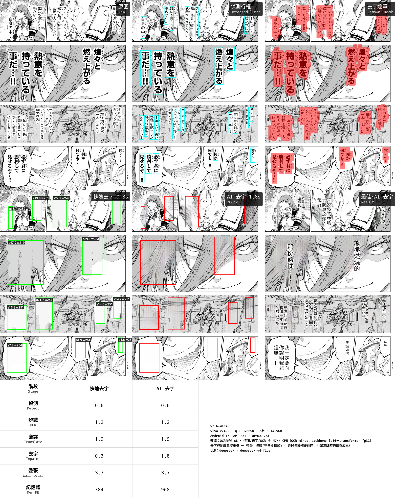

# Yakuyomi — manga translation engine

On-device detection, OCR and text removal (all on NCNN), plus cloud-LLM translation. Japanese to Traditional Chinese by default; any source and target language can be set.

English ｜ [中文](README_zh.md)

Status: the full pipeline runs on-device and drives the Yakuyomi reader app — translate-on-download, read-as-you-go live translation, and cheap re-rendering all work. The reader's [first public release](https://github.com/joyeli/Yakuyomi/releases/latest) is out.

This repo is the **engine** (`yakuyomi-engine`) — the translation library, not an installable app. **Want the app?** It's the reader, **Yakuyomi**, a [mihon](https://github.com/mihonapp/mihon) fork: [**download the signed APK**](https://github.com/joyeli/Yakuyomi/releases/latest) or see its [repo](https://github.com/joyeli/Yakuyomi). This engine repo pulls into it as a submodule; see [Repository layout](#repository-layout).

## Where to start

| You want to… | Go to |
|---|---|
| **See it run** | [**Try it**](#try-it) below — build the sandbox app, put it on an arm64 phone, watch a page go through the pipeline. An LLM key is optional: without one, translation is skipped and you still get detection, OCR and text removal. |
| **Integrate the engine into your app** | [**`engine/README.md`**](engine/README.md) — the API surface: `translatePage`, getting the models in, configuration, result handling, threading. |
| **Rebuild the models yourself** | [**`docs/BUILD_MODELS.md`**](docs/BUILD_MODELS.md) — from the upstream checkpoints, with the traps and the verification criteria. Advanced: ours are downloadable, so you never need this to *use* the engine. |

## What it is

Yakuyomi translates manga pages. Four of the five stages run on the device (NCNN for detection, OCR and text removal, Canvas for typesetting); only translation calls out to a network LLM:

```
page bitmap
  detect    (NCNN)   text-line boxes + per-pixel stroke mask
  OCR       (NCNN)   one forward per line  ->  source text
  group             merge aligned lines into bubble regions
  translate (LLM)   one request per page
  remove    (NCNN)   erase the original text (flat-fill or AOT-GAN reconstruction)
  typeset   (Canvas) draw the translation back
  translated bitmap
```

The engine exposes one call, `translatePage(page): PageResult` (translated / skipped / failed). Writing the file back, the "translated" marker, resume, the background translation queue, and read-as-you-go live translation belong to the reader app.



From the sandbox app: one page taken through the pipeline — detection, removal mask, the two text-removal modes with their detected regions, and the finished typeset — with a table breaking down each stage's time and peak memory, and a banner recording the device, the active settings, and the LLM.


Text over artwork is the hard case. A box-fill (what most overlay translators do) smears a colour block over the hair; Yakuyomi's AI removal reconstructs the strands underneath before typesetting the translation.

## Goals

- **Speed over maximal quality — a deliberate tradeoff for a phone.** The first instinct was to chase image quality: LaMa inpainting, per-region native-resolution reconstruction, the sharpest text removal possible. On a phone that is a dead end — those cost seconds per page and gigabytes of memory, and the reader stalls. On an end device the goal is not the last few percent of quality but *speed*: a page has to appear while you read. So every stage is settled at the quality/efficiency knee, not the quality ceiling:
  - **OCR** on NCNN in mixed precision — fp16 backbone, fp32 transformer head. All-fp16 misreads small kana (219 of 242 lines on 9 pages), and so did the int8 ONNX Runtime model it replaces (223/242); mixed reads 241/242 while running ~23% faster than that int8 model.
  - **Detection and text removal** likewise on NCNN's mobile kernels (NEON/Winograd). The detector runs in fp16 — int8 quantization was tried and produced no boxes at all, with no speedup on ARM.
  - **Text removal at tile 768** — whole-page AOT-GAN, the point where quality is good *and* the work stays hidden under the translation wait (see Concurrency). A larger tile or per-region reconstruction is marginally sharper but pokes above that wait; LaMa is slower and blurrier. **GPU/NPU was tried and does not work for these models** — NCNN's Vulkan path miscomputes the AOT-GAN (garbage output), and LiteRT cannot compile it — so everything runs on the **CPU**, which turned out to be enough.

  Measured on a Snapdragon 8 Gen 3, over 9 pages / 242 detected lines: detection averages **0.79 s per page** and the mixed-precision OCR **1.25 s per page** (23% less than the int8 OCR it replaced); all 242 lines are read, 241 of them identical to an fp32 reference. On the 6-page recall set (161 detected boxes) it reads back 160 — 99.4%, the same as the int8 model it replaced — in 4.9 s of OCR instead of 7.5 s (same device, same day, warm engine). Translation and text removal come on top of that, and overlap each other (see Concurrency). Peak memory was ~1.9–2.1 GB with the previous build (not yet re-measured after the OCR change) — no GPU, nowhere near 16 GB of RAM.
- **Concurrency, two layers.**
  - *Within a page* — text removal needs only the OCR'd regions, known before the LLM replies, so it runs on a background coroutine while the translate request is in flight; a page pays only the longer of the two. (This is why a failed block keeps its re-pasted source text rather than the untouched image — decoupling removal from the translation result is what lets them overlap.)
  - *Across pages* — `translatePage` is safe to call concurrently on one warm engine (shared detection / OCR / translator / removal sessions; benchmarked on device — no crash, no corruption). So the reader can pipeline: page N's network translate overlaps page N+1's on-device detect/OCR. With the cheap box-fill removal the pipeline reaches the network-bound ceiling — about **2× the sequential rate** at a shallow depth (~4). Pages read first at box-fill quality, then upgrade to full AOT-GAN removal when idle (re-render, below).
- **Configurable, and ready to be public.** Provider, model, API base, key, and language pair are all settings (bring your own key). Models are loaded from a folder you pick, not bundled (bring your own model). About 20 engine parameters are exposed; see [docs/PARAMETERS.md](docs/PARAMETERS.md).
- **Never make the library worse.** A page is overwritten only when translation succeeds. If a page has no text, or every line fails, or the network drops, the original is kept untouched. Blocks whose translation fails keep their Japanese text instead of being blanked.


Two layers of concurrency. *Within a page*, text removal (CPU) overlaps the translation (network) — a page pays only the longer of the two. *Across pages*, `translatePage` is safe to call concurrently on one warm engine, so pages pipeline: page N's translate overlaps page N+1's on-device detect/OCR. Benchmarked on device — about **2× the sequential rate** at a shallow depth with box-fill removal.

## What it can do

- **Detection** — DBNet (ResNet34 + DB head, manga-image-translator's default detector) on NCNN. It replaced comic-text-detector, which is gone: DBNet reads **1.6–2.5× more text correctly** on device. Pages are resized aspect-preserving to 1024 and padded to a multiple of 256 — a rectangular input, which also avoids an ncnn heap-corruption bug on square sizes between 832 and 992. Returns text-line quads and a per-pixel stroke mask used to limit text removal to the glyphs.
- **OCR** — a 48px CTC model on NCNN in **mixed precision**: the convolutional backbone runs fp16, the transformer and character head fp32 (ncnn's per-layer featmask plus an explicit Cast layer between them). The sinusoidal positional encoding is computed per strip and fed as a second input rather than traced into the graph, so any strip width works. On device it reads 241 of 242 lines identically to fp32 (int8: 223, all-fp16: 219 — both misread small kana) and is ~23% faster than the int8 ONNX Runtime model it replaced. One forward per line, decoded greedily; lines are recognized concurrently. The mixed-precision param needs an ARMv8.2 fp16 CPU; elsewhere the engine loads the plain param and runs fp32.
- **Translation** — a cloud LLM with the line-numbered protocol from manga-image-translator. Any OpenAI-compatible provider works; presets cover manga-image-translator's set (OpenAI, DeepSeek, Gemini, Groq, Qwen, Sakura, custom) plus OpenRouter, each with its model list fetched live. DeepSeek by default. The engine sends one request per page; running pages concurrently (and rate-limiting them) is the caller's job — the reader does it with a semaphore, see Concurrency above. A failed line falls back to its source text rather than breaking the page. See [docs/PROVIDERS.md](docs/PROVIDERS.md).
- **Text removal** — two modes on NCNN. Speech bubbles are always flat-filled (clean, no halo); the modes differ in how text drawn over artwork is handled:

  | Mode | How | Speed |
  |---|---|---|
  | Fast (BoxFill) | flat-fill with the nearest background colour (becomes a colour block over artwork) | fastest |
  | AI removal (default) | AOT-GAN reconstructs the artwork under the text, whole-page at tile 768 | slower, sharp — and hidden under the translation wait |

- **Typesetting** — text-box layout, vertical or horizontal, with adaptive font size, vertical centering, outline scaled to the font, line-head kinsoku, and tilt-aware placement (text follows a slanted bubble's angle). Text colour is chosen from the cleaned background (black on light, white on dark).
- **Re-rendering (analyze | render split)** — a translated page comes back with its analysis: the text mask, plus the regions carrying their source and target text. The text-removal method can then be changed and the page re-typeset without re-running detection, OCR, or the LLM — switching removal mode or upgrading quality costs only the removal and typeset stages, no tokens.
- **Languages** — Japanese to Traditional Chinese out of the box. Set a different target, source, and few-shot example for any pair. Traditional-Chinese output relies on the prompt; there is no OpenCC post-processing.

## Repository layout

Two repos:

| Repo | Role |
|---|---|
| `yakuyomi-engine` (this one) | the engine: `:engine` (the pipeline, exposing only `translatePage`), a `:app-sandbox` for exercising it on a device, and the `parity/` desktop validation harness. No reader code. |
| `Yakuyomi` (a mihon fork) | the reader app: mihon with the download hook, translation settings, and model management. Consumes the engine as a git submodule via Gradle `includeBuild`. |

The engine stays reader-agnostic so it can be tested on its own; the app is a real mihon fork. Engine work is committed here, and the app bumps the submodule pointer.

## Models

Weights are not committed and not packed into the APK. The reader can auto-download them, or you supply them manually from a folder you choose — see [docs/MODELS.md](docs/MODELS.md) for sources, checksums, and licensing.

| Stage | Model | Backend | Source |
|---|---|---|---|
| Detection | DBNet, ResNet34 + DB head (`.ncnn.param`/`.bin`) | NCNN | from [manga-image-translator](https://github.com/zyddnys/manga-image-translator) (its default detector) |
| OCR | 48px CTC, mixed fp16/fp32 (`.ncnn.param` ×2 + `.bin`) | NCNN | weights from [manga-image-translator](https://github.com/zyddnys/manga-image-translator) |
| Text removal | AOT-GAN manga inpaint (`.ncnn.param`/`.bin`) | NCNN | from [manga-image-translator](https://github.com/zyddnys/manga-image-translator) |
| Fonts | Noto Sans/Serif CJK, Source Han | — | CJK rendering (OFL / Apache) |

Everything is NCNN, shipped as `.param` + `.bin` (both required); OCR has two `.param` files (plain and `_mixed`) over one `.bin`, and the engine picks between them at load time. The full set is about 247 MB — the fp16 detector (153 MB) and the fp16 OCR weights (83 MB) make up most of it.

## Try it

The engine is an Android library (arm64, NCNN), so trying it means building the sandbox app (`:app-sandbox`) and installing it. **A real arm64 Android device is required** — the sandbox only builds `arm64-v8a`, so an x86 emulator won't run it.

**1. Get the models.** They aren't in the repo. Fetch the six files listed in [`models.json`](models.json) — the detector `.param`+`.bin` from the `models-v3` release, the OCR `.param` (plain and `_mixed`) + `.bin` from `models-v4`, and the inpaint `.param`+`.bin` from `models-v2` — and put them all in one folder the phone can read. Details, checksums and licensing: [docs/MODELS.md](docs/MODELS.md).

**2. (Optional) Add an LLM key.** Enter your DeepSeek key in the sandbox app itself (the field under the model-folder button; it is stored in the app's preferences — the APK never embeds a key). **Skip this and translation is simply off**: detection, OCR and text removal still run. `api-keys.properties` (copied from `api-keys.properties.example`) is only read by the desktop parity scripts.

**3. Build and install.**

```
./gradlew :app-sandbox:assembleDebug
adb install app-sandbox/build/outputs/apk/debug/app-sandbox-debug.apk
```

**4. Run it.** Open the app, tap *選擇模型資料夾* (pick model folder) and choose the folder from step 1. Then:

| Button | What it does |
|---|---|
| *偵測 + OCR 檢驗* (detect + OCR check) | **Start here.** Runs the built-in test pages through detection + OCR at the product defaults and prints boxes / lines read / timings. No image picking, no key needed. |
| *診斷* (diagnose) | Pick a thumbnail → the **full pipeline** (detection → OCR → translation → removal → typeset) with per-stage timings. Without a key, the translation step is skipped. |
| *效能比較* (compare) | One image, both text-removal modes side by side. |

The buttons are grouped into *選圖測試* (runs the thumbnails you selected) and *固定圖測試* (runs built-in images, ignores the selection). The sandbox UI is in Chinese — it is our own development tool, not a product surface.

Want to build the models yourself from the upstream checkpoints instead of downloading ours? See [docs/BUILD_MODELS.md](docs/BUILD_MODELS.md).

The reader app, Yakuyomi, lives in the separate fork repo.

## Configuration

Every tunable parameter, its range, and the effect of changing it is documented in [docs/PARAMETERS.md](docs/PARAMETERS.md). The reader's translation settings expose the same set, grouped by stage, with the advanced knobs behind a toggle.

## How it relates to manga-image-translator

The engine is a from-scratch Kotlin implementation. It contains no manga-image-translator source code; what it borrows is behaviour — the translation prompt and protocol, the parameter schema (many defaults retuned for on-device), the model choice and processing order. The details, and the layered alignment policy, are in [docs/ARCHITECTURE.md](docs/ARCHITECTURE.md).

## Credits

- [mihon](https://github.com/mihonapp/mihon) — the reader the app forks (Apache-2.0)
- [manga-image-translator](https://github.com/zyddnys/manga-image-translator) — prompt and behaviour reference; the DBNet detection, OCR, and AOT-GAN inpaint model weights
- [ncnn](https://github.com/Tencent/ncnn) — the on-device inference runtime for all three models
- Noto Sans/Serif CJK, Source Han — fonts

## License

**GPL-3.0** — see [LICENSE](LICENSE). The code here is written from scratch in Kotlin, but it ports manga-image-translator's prompts, parameter schema, and grouping; as a derivative of that GPL-3.0 project, this engine is GPL-3.0.

Component licenses:
- [manga-image-translator](https://github.com/zyddnys/manga-image-translator) — GPL-3.0 (prompt/protocol, detection/OCR/removal behaviour, line grouping; DBNet detection model, 48px CTC OCR model, and AOT-GAN inpaint model)
- [ncnn](https://github.com/Tencent/ncnn) — BSD-3-Clause (inference runtime, statically linked)
- [mihon](https://github.com/mihonapp/mihon) — Apache-2.0 (reader fork lives in the separate product repo; Apache-2.0 is GPL-3.0-compatible, so the combined app is GPL-3.0)

Model weights are all GPL-3.0 and are **redistributed** through this repo's releases for one-tap auto-download — the manifest is [`models.json`](models.json), pointing at the detector in [`models-v3`](https://github.com/joyeli/yakuyomi-engine/releases/tag/models-v3), the OCR in [`models-v4`](https://github.com/joyeli/yakuyomi-engine/releases/tag/models-v4), and the unchanged inpaint assets in [`models-v2`](https://github.com/joyeli/yakuyomi-engine/releases/tag/models-v2) (see [docs/MODELS.md](docs/MODELS.md)); you can also bring your own from the sources above. Fonts are not bundled (system CJK fallback).
