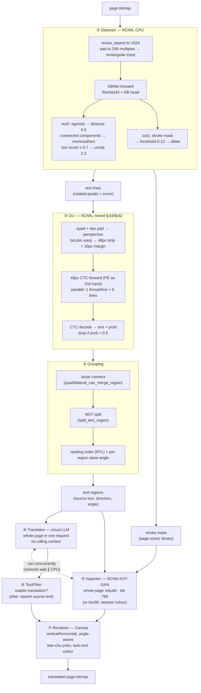

# `:engine` — Yakuyomi translation engine

English ｜ [中文](README_zh.md)

An on-device manga translation library (Android, Kotlin, NCNN). Give it a page bitmap, get back a translated page bitmap. Detection, OCR, and text removal run on the device, all on NCNN; translation calls a cloud LLM (OpenAI-compatible).

The module is reader-agnostic. Its only job is `translatePage(bitmap) -> PageResult`. Overwriting files, markers, resume, and cross-page batching are the caller's responsibility (see [Result handling](#result-handling)). The reader app (the [Yakuyomi](https://github.com/joyeli/Yakuyomi) mihon fork) consumes it via Gradle composite build.

> **This page is the integration guide.** If you'd rather just *see it run* first, the [repo README](../README.md#try-it) walks through building the sandbox app and putting it on a phone — no integration needed. If you want to rebuild the model weights yourself from the upstream checkpoints, that's [docs/BUILD_MODELS.md](../docs/BUILD_MODELS.md).

Group: `li.joye.yakuyomi:engine`. Min SDK 26.

## Quick start

```kotlin
// 1. Point at the model files on local disk (see Models). All three are NCNN
//    (.param + .bin); OCR has two .param files (plain and _mixed) over one .bin.
//    Easiest is to let the engine pick them out of a folder listing:
val models = ModelSet.resolve(localModelFiles) ?: return // null = not all present
// or name the files explicitly (NCNN roles take the .param path; the matching
// .bin must sit alongside it):
val models = ModelSet(
    detectorNcnn     = "/path/dbnet_detect.ncnn.param",
    ocr              = "/path/ocr_48px_ctc.ncnn.param",  // or the _mixed one; the engine picks at load
    aotInpainterNcnn = "/path/mit_aot_fixed512.ncnn.param",
)

// 2. Load the OCR alphabet (in the engine assets) and your API key.
val alphabet: List<String> = assets.open("models/alphabet-all-v5.txt").bufferedReader().readLines()
val apiKey = "<deepseek key>"   // null/blank = detect+OCR+remove only, no translation (debug)

// 3. Create the engine and translate. use { } releases the native NCNN nets.
Yakuyomi.create(models, alphabet, apiKey).use { engine ->
    when (val r = engine.translatePage(pageBitmap)) {
        is PageResult.Translated -> writeBack(r.page)   // success: overwrite + mark done
        is PageResult.Skipped    -> { /* nothing to translate: keep original */ }
        is PageResult.Failed     -> { /* error: keep original, retry later */ }
    }
}
```

`translatePage` is a `suspend` function; call it from a background dispatcher. It is safe to call concurrently on one warm engine instance, which is how the reader pipelines pages — see [Lifecycle and threading](#lifecycle-and-threading).

## Models

The engine ships no model weights — you get them onto the device one of two ways.

**Auto-download.** The engine fetches them itself: `ModelDownloader` reads this repo's [`models.json`](../models.json) manifest, downloads each file into a directory you pick, and verifies every sha256 (files already present and valid are skipped). This is what the reader app does.

```kotlin
val remote = ModelDownloader.fetchManifest()        // defaults to this repo's models.json on main
val dir = File(context.filesDir, "models")
ModelDownloader.ensure(remote, dir) { progress ->   // ModelProgress.Downloading(role, name, bytes) …
    updateNotification(progress)
}
val models = ModelSet.resolve(dir.listFiles()!!.map { it.name to it.absolutePath })!!
```

**Bring your own model (BYOM).** Or supply the files yourself — put them anywhere local and either let `ModelSet.resolve` name-match them, or name each role explicitly (see [Quick start](#quick-start)).

Either way it's the same six files, all NCNN (`.param` + `.bin`, both required; OCR has two `.param` files — plain and `_mixed` — over one `.bin`):

| Role | File (typical name) | Backend | What it does | Source |
|---|---|---|---|---|
| detector | `dbnet_detect.ncnn.param` (+ `.bin`) | NCNN | text boxes + stroke mask | DBNet, from [manga-image-translator](https://github.com/zyddnys/manga-image-translator) (its default detector) |
| ocr | `ocr_48px_ctc.ncnn.param` + `ocr_48px_ctc_mixed.ncnn.param` (+ `.bin`) | NCNN | 48px CTC Japanese OCR, mixed fp16/fp32 | manga-image-translator |
| inpainter | `mit_aot_fixed512.ncnn.param` (+ `.bin`) | NCNN | AOT-GAN text removal | [manga-image-translator](https://github.com/zyddnys/manga-image-translator) |

`ModelSet.resolve(files)` maps a flat `(filename, localPath)` listing to the roles by filename and extension: `.param` containing `dbnet` is the detector, `.param` containing `aot` is the inpainter, `.param` containing `ocr` is OCR (either OCR param — `Ocr` switches to `_mixed` or back itself after checking the CPU). It returns `null` if any of the three is missing — use that as your "ready to translate?" check. Note every role needs both files: `resolve` only sees the `.param`, so make sure the matching `.bin` sits next to it (and, for OCR, the other `.param`).

Paths must be local files, not SAF/content URIs: the backends load from the path into native memory. Don't read weights into the JVM heap with `readBytes()`; the heap is capped around 512 MB regardless of device RAM and will OOM. If the source is SAF, copy to `filesDir` first and pass the path.

## Configuration

Everything is a `data class` with defaults; override only what you need:

```kotlin
val config = EngineConfig(
    ocr        = OcrConfig(minProb = 0.5f),               // drop low-confidence OCR
    inpainter  = InpainterConfig(method = "aot"),        // "boxfill" (fast) | "aot" (AI)
    render     = RenderConfig(orientation = TextOrientation.AUTO),
    translator = TranslatorConfig(model = "deepseek-v4-flash", temperature = 0.3),
)
Yakuyomi.create(models, alphabet, apiKey, config)
```

The full list, with ranges and the effect of each, is in [`docs/PARAMETERS.md`](../docs/PARAMETERS.md). A few defaults worth knowing:

- `OcrConfig.ncnnMixed = true`, `ncnnFp16Storage = true`, `ncnnFp16Arith = true`. OCR runs in mixed precision — fp16 backbone, fp32 transformer — through the `_mixed` param, which the engine loads only when these hold *and* the CPU has ARMv8.2 fp16 (`NcnnBackend.cpuSupportsFp16`); otherwise it loads the plain param over the same `.bin`. All-fp16 misreads small kana (219/242 lines on device) and all-fp32 is 32–45% slower; mixed reads 241/242 and is ~23% faster than the int8 ONNX Runtime model it replaced. Leave them on.
- `OcrConfig.concurrent = true`, `concurrency = 8`. OCR recognizes lines in parallel on a single-threaded net; on an 8-core phone this roughly halves OCR time, with no change to output.
- `OcrConfig.stripPad = 4`. Widens each detection quad by 4 px before cropping the OCR strip (the detection box itself is untouched, so text removal is unaffected). Thin boxes otherwise clip the last glyph and the CTC head returns an empty string, which drops the whole region — see [Why these defaults](#why-these-defaults).
- `InpainterConfig.method = "aot"`. Two flavours of text removal: `"boxfill"` (fast text removal) flat-fills every text region with the nearest background colour — instant, cleanest on flat bubbles, but paints a colour block over busy artwork; `"aot"` (AI text removal, default) rebuilds the background under every text region with a whole-page AOT-GAN pass (`tileSize = 768`) — slower, but reconstructs the artwork instead of blocking it.
- `RenderConfig.orientation = AUTO`. Follows each region's detected direction, then rotates along the region's skew angle.
- `TranslatorConfig.provider = "deepseek"`, with `apiBase` and `model`. Any OpenAI-compatible endpoint. `LlmProviders.ALL` carries presets for manga-image-translator's LLM set plus OpenRouter (all OpenAI-compatible; Gemini via its compat endpoint), and `LlmModels.list()` fetches a provider's live model list. See [`docs/PROVIDERS.md`](../docs/PROVIDERS.md).

### Language pair (not fixed to JP→CHT)

Default is Japanese to Traditional Chinese, but any pair works. Set these together:

```kotlin
translator = TranslatorConfig(
    toLangName   = "English",   // target: the LLM translates into this
    fromLangName = "Korean",    // source label for the prompt ("" = let the LLM infer)
    sampleSource = "<|1|>…",    // few-shot example in the source language ("" = no example)
    sampleTarget = "<|1|>…",    // and its translation, in the target language
)
```

The source is whatever the OCR model recognizes; the bundled 48px CTC is Japanese, so load a different OCR model and alphabet to read another language. The target is purely the prompt. Keep `toLangName` and the few-shot in the same target language, or the example biases the output.

## Result handling

`translatePage` returns a `PageResult`, not a bare bitmap, so the caller can honour the core invariant: never overwrite the original with something worse.

| Variant | Meaning | What the caller does |
|---|---|---|
| `Translated(page, stats)` | success | overwrite the file, write a "translated" marker |
| `Skipped(reason, stats)` | nothing translatable (no text / OCR empty / all filtered) | keep original, mark skipped, don't retry |
| `Failed(reason)` | error (network/429/exception) | keep original, no marker, retry later |

Per-region resilience is built in: if one bubble fails to translate, the engine draws its source text back instead, and the rest of the page still translates. `PageStats` carries per-stage timings, plus `wallMs` (the actual elapsed time, which is shorter than the stage sum because text removal overlaps the translation request).

## Lifecycle and threading

- `TranslationEngine : AutoCloseable`. `close()` releases the detector, OCR, and inpainter NCNN nets. Always `use { }` or `close()`.
- `translatePage` is `suspend` and **safe to call concurrently on one warm instance** — that is how the reader pipelines pages (page N's network translate overlapping page N+1's detect/OCR). It also uses coroutines internally (parallel OCR, removal overlapping translation). What makes concurrent calls safe:
  - **Translation is per-call.** `LlmTranslator.translateDetailed` runs entirely on locals and returns its result (translations, usage, error, raw) from the call, so concurrent pages never clobber each other. The single-value diagnostic fields `lastError` / `lastRaw` *do* race and exist only for single-threaded callers like the sandbox; the pipeline doesn't read them.
  - **Multi-threaded NCNN inference is serialized.** Detection and removal take a global lock inside the backend: ncnn parallelises with OpenMP, and two threads entering a forward at once abort the process (`__kmp_abort_process`). Serializing costs almost no throughput — both stages are CPU-bound and already fit inside the network wait, and a CPU can't truly run two of them at once anyway. OCR is NCNN too, but its net is built with one thread (no OpenMP team to collide), so its per-line forwards skip the lock and stay concurrent, as does translation (network).
  - **Warm, though.** The engine doesn't warm itself up: firing several pages at freshly loaded native sessions whose lazy init hasn't run crashed on device. The reader runs the first page after a load single-threaded, then allows concurrency.
- The input bitmap isn't recycled by the engine. `Translated.page` is a new bitmap.

## Pipeline



Text removal (⑤) runs **concurrently** with the translation request (④): removal is CPU-bound, translation is network-bound, and neither needs the other's output — so `PageStats.wallMs` is shorter than the sum of the stages.

See [`docs/ARCHITECTURE.md`](../docs/ARCHITECTURE.md) for the design rationale and the desktop-parity validation. Behaviour follows [manga-image-translator](https://github.com/zyddnys/manga-image-translator).

## Why these defaults

The pipeline mirrors manga-image-translator, but every parameter is re-tuned against real hardware (Snapdragon 8 Gen 3) rather than inherited. Where a default differs from upstream, an on-device A/B backs it:

| | manga-image-translator | this engine | measured reason |
|---|---|---|---|
| detection size | 2048 (its default) | **1024** | 4× fewer pixels per forward than upstream's default. Spot-checked rather than proven in general: on m-i-t's own pipeline, page 006's 「その通りじゃ」 has a box at 1024 but OCRs *empty* there, and only reads at 1536 and 2048 — this engine reads it at 1024, thanks to the OCR crop fixes below. (Larger isn't free: at 1280+ character errors go up and it gets slower.) |
| OCR precision | fp32 torch | **NCNN mixed: fp16 backbone, fp32 transformer** | all-fp16 and int8 both misread small kana (219 and 223 of 242 lines); mixed reads 241/242, ~23% faster than the int8 ONNX Runtime model that shipped before |
| OCR crop resampling | bilinear | **hand-rolled bicubic perspective warp** | recovers small kana — including sentence-final negations, whose loss silently *inverts* a line's meaning |
| OCR crop box | detection quad as-is | **quad + 4px pad** | thin boxes clip the last glyph → CTC returns empty → the region is dropped and left untranslated. On 6 pages: 2 rescued, **0 regressions**, and OCR ~20% faster |
| text removal | LaMa / per-region AOT | **AOT-GAN, whole-page tile 768** | 5–9× faster on CPU at equal or better quality; per-region AOT can't parallelise on CPU |

Current numbers (9 pages, 242 detected lines, on-device): **all 242 read**, 241 identical to an fp32 reference; detection averages **0.79 s/page**, mixed-precision OCR **1.25 s/page** — 23% less than the int8 OCR it replaced.

Two things measurement said *not* to do, kept here so they aren't re-attempted:

- **Don't lower `dbBoxThreshold` below upstream's 0.7.** Over one 16-page chapter it barely moves the box count — 401 at 0.7, 405 at 0.6, 406 at 0.5 — and those few extra boxes don't survive the second gate: `Ocr` leaves any line scoring under `minProb` blank, and `Pipeline` drops blank regions. Complete sentences actually recovered: **zero**.
- **Don't int8-quantise the detector.** It produces **zero** boxes, and is no faster on ARM.

## Advanced: direct component access

The factory is the recommended path. For per-stage debugging (a detection overlay, say) you can construct the stages yourself and assemble a `Pipeline`, but then you own their lifecycle:

```kotlin
val detector = Detector(models.detectorNcnn, config.detector)
val detection = detector.detect(page)   // lines + textMask, draw your overlay
// …
detector.close()                         // close what you create
```

Pure helpers (`Geometry`, `ImageOps`, `TextFilter`) are `internal`, not part of the public API.
