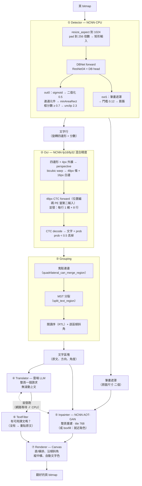

# `:engine` — Yakuyomi 翻譯引擎

[English](README.md) ｜ 中文

裝置端漫畫翻譯 library（Android，Kotlin、NCNN）。給它一張頁 bitmap，回一張翻好的頁 bitmap。偵測、OCR、去字在裝置上跑、全走 NCNN；翻譯呼叫雲端 LLM（OpenAI 相容）。

這個 module 跟 reader 無關，只做一件事：`translatePage(bitmap) -> PageResult`。覆蓋檔案、標記、續傳、跨頁批次是呼叫端的事（見[結果處理](#結果處理)）。reader app（[Yakuyomi](https://github.com/joyeli/Yakuyomi) mihon fork）用 Gradle composite build 引入。

> **這頁是整合指南。** 如果你只想**先看它跑**，[repo README](../README_zh.md#試跑) 有一條路：把 sandbox app 編出來裝到手機上，不必整合任何東西。如果你想自己從上游 checkpoint 把模型轉出來，那是 [docs/BUILD_MODELS_zh.md](../docs/BUILD_MODELS_zh.md)。

Group：`li.joye.yakuyomi:engine`。Min SDK 26。

## 快速開始

```kotlin
// 1. 指向本機模型檔（見模型）。三顆全走 NCNN（.param + .bin 成對）；
//    OCR 有兩份 .param（一般版與 _mixed）共用一份 .bin。最省事是讓引擎從資料夾清單裡挑：
val models = ModelSet.resolve(localModelFiles) ?: return // null = 沒到齊
// 或明確指定各檔（NCNN 角色給 .param 路徑，對應的 .bin 要放在旁邊）：
val models = ModelSet(
    detectorNcnn     = "/path/dbnet_detect.ncnn.param",
    ocr              = "/path/ocr_48px_ctc.ncnn.param",  // 或 _mixed 那份；引擎載入時自己選
    aotInpainterNcnn = "/path/mit_aot_fixed512.ncnn.param",
    charSegYoloNcnn  = "/path/manga_seg_s.ncnn.param",   // 選配（只有夜讀用）；預設 null
    charSegCsegNcnn  = "/path/cartoonseg.ncnn.param",    // 選配（只有夜讀用）；預設 null
)

// 2. 載 OCR 字典（在引擎 assets 裡）跟你的 API key。
val alphabet: List<String> = assets.open("models/alphabet-all-v5.txt").bufferedReader().readLines()
val apiKey = "<deepseek key>"   // null/空 = 只偵測+OCR+去字、不翻譯（debug）

// 3. 建引擎、翻譯。use { } 會釋放 native NCNN net。
Yakuyomi.create(models, alphabet, apiKey).use { engine ->
    when (val r = engine.translatePage(pageBitmap)) {
        is PageResult.Translated -> writeBack(r.page)   // 成功：覆蓋 + 標記完成
        is PageResult.Skipped    -> { /* 沒東西可翻：保留原圖 */ }
        is PageResult.Failed     -> { /* 出錯：保留原圖、之後重試 */ }
    }
}
```

`translatePage` 是 `suspend`，從背景 dispatcher 呼叫。對同一個 **warm** 引擎實例並發呼叫是安全的，reader 就是這樣做跨頁流水線——見[生命週期與執行緒](#生命週期與執行緒)。

## 模型

引擎不帶模型權重——把模型弄到裝置上有兩條路。

**自動下載。** 引擎自己會抓：`ModelDownloader` 讀本 repo 的 [`models.json`](../models.json) manifest、把每個檔下載到你指定的資料夾、並逐檔驗 sha256（已存在且驗過的會跳過）。reader app 走的就是這條。

```kotlin
val remote = ModelDownloader.fetchManifest()        // 預設抓本 repo main 上的 models.json
val dir = File(context.filesDir, "models")
ModelDownloader.ensure(remote, dir) { progress ->   // ModelProgress.Downloading(role, name, bytes) …
    updateNotification(progress)
}
val models = ModelSet.resolve(dir.listFiles()!!.map { it.name to it.absolutePath })!!
```

**自備模型（BYOM）。** 或自己放檔——放在任何本機路徑，讓 `ModelSet.resolve` 按檔名比對，或明確指定各角色（見[快速開始](#快速開始)）。

兩條路要的是同樣那六個檔（翻譯），全走 NCNN（`.param` + `.bin`，兩個都要；OCR 有兩份 `.param`——一般版與 `_mixed`——共用一份 `.bin`），外加選配的四個檔（夜讀）：

| 角色 | 檔名（常見） | 後端 | 做什麼 | 來源 |
|---|---|---|---|---|
| detector | `dbnet_detect.ncnn.param`（+ `.bin`） | NCNN | 文字框 + 筆畫遮罩 | DBNet，出自 [manga-image-translator](https://github.com/zyddnys/manga-image-translator)（它的 default 偵測器） |
| ocr | `ocr_48px_ctc.ncnn.param` + `ocr_48px_ctc_mixed.ncnn.param`（+ `.bin`） | NCNN | 48px CTC 日文 OCR，fp16/fp32 混合精度 | manga-image-translator |
| inpainter | `mit_aot_fixed512.ncnn.param`（+ `.bin`） | NCNN | AOT-GAN 去字 | [manga-image-translator](https://github.com/zyddnys/manga-image-translator) |
| charseg（yolo）→ `charSegYoloNcnn` | `manga_seg_s.ncnn.param`（+ `.bin`） | NCNN | 夜讀用的人物遮罩（YOLO11-seg，只取人物類）——選配 | 權重來自 Hugging Face [anonimkaq4/manga-page-element-segmentation](https://huggingface.co/anonimkaq4/manga-page-element-segmentation)；非 GPL，見 [docs/MODELS_zh.md](../docs/MODELS_zh.md#夜讀模型) |
| charseg（cseg）→ `charSegCsegNcnn` | `cartoonseg.ncnn.param`（+ `.bin`） | NCNN | 夜讀用的人物遮罩（CartoonSegmentation RTMDet-Ins）——選配 | 權重來自 Hugging Face [Jakaline/CartoonSegmentationOnnx](https://huggingface.co/Jakaline/CartoonSegmentationOnnx)；非 GPL，見 [docs/MODELS_zh.md](../docs/MODELS_zh.md#夜讀模型) |

`ModelSet.resolve(files)` 把一份扁平的 `(檔名, 本機路徑)` 清單按檔名加副檔名對到各角色：`.param` 含 `dbnet` 是偵測器、`.param` 含 `aot` 是去字、`.param` 含 `ocr` 是 OCR（兩份 OCR param 給哪份都行——`Ocr` 查過 CPU 後自己切到 `_mixed` 或切回來）。三顆少任一就回 `null`——拿這個當「能翻了嗎？」的檢查。另外兩個關鍵字是選配：`.param` 含 `manga_seg` → `charSegYoloNcnn`、含 `cartoonseg` → `charSegCsegNcnn`。缺了不會讓 `resolve` 回 `null`——翻譯就緒不看夜讀模型——欄位就只是 `null`，`NightReadRenderer.charSegmenter(models.charSegYoloNcnn, models.charSegCsegNcnn)` 拿手上有的建分割器（兩顆 → 聯集、一顆 → 那顆、零顆 → `null`、夜讀不可用）。注意每個角色都要兩個檔：`resolve` 只看得到 `.param`，對應的 `.bin`（OCR 還有另一份 `.param`）請自行確保放在旁邊。

路徑必須是本機檔，不能是 SAF/content URI：後端直接從路徑載進 native 記憶體。別用 `readBytes()` 把權重讀進 JVM heap；heap 上限約 512MB（跟裝置 RAM 無關）會 OOM。來源是 SAF 的話，先複製到 `filesDir` 再傳路徑。

## 設定

全是有預設的 `data class`，只覆蓋你要的：

```kotlin
val config = EngineConfig(
    ocr        = OcrConfig(minProb = 0.5f),               // 丟低信心 OCR
    inpainter  = InpainterConfig(method = "aot"),        // "boxfill"（快速）| "aot"（AI）
    render     = RenderConfig(orientation = TextOrientation.AUTO),
    translator = TranslatorConfig(model = "deepseek-v4-flash", temperature = 0.3),
)
Yakuyomi.create(models, alphabet, apiKey, config)
```

完整清單、值域、各參數的效果在 [`docs/PARAMETERS_zh.md`](../docs/PARAMETERS_zh.md)。幾個值得知道的預設：

- `OcrConfig.ncnnMixed = true`、`ncnnFp16Storage = true`、`ncnnFp16Arith = true`。OCR 走混合精度——backbone fp16、transformer fp32——用的是 `_mixed` 那份 param；引擎只在這三個都開**且** CPU 有 ARMv8.2 fp16（`NcnnBackend.cpuSupportsFp16`）時才載它，否則用同一份 `.bin` 載一般版 param。全 fp16 會讀錯小假名（真機 242 行只對 219）、全 fp32 慢 32–45%；混合精度讀對 241/242，比它取代的 int8 ONNX Runtime 模型快 ~23%。維持開著。
- `OcrConfig.concurrent = true`、`concurrency = 8`。OCR 在單緒的 net 上把文字行並發辨識；8 核手機上 OCR 時間大約砍半，輸出不變。
- `OcrConfig.stripPad = 4`。裁 OCR 條之前把偵測四邊形往外擴 4px（**偵測框本身不動**，所以去字不受影響）。不擴的話瘦框會把最後一個字切掉、CTC 吐空字串 → 整區被丟掉不翻，見[為何是這些預設](#為何是這些預設)。
- `InpainterConfig.method = "aot"`。去字分兩門別：`"boxfill"`（快速去字）把每個字區用就近的背景色平塗——瞬間、平/單色泡泡最乾淨，但壓在畫面上的字會塗成色塊；`"aot"`（AI 去字，預設）用整頁一次的 AOT-GAN pass 重建每個字區底下的背景（`tileSize = 768`）——較慢，但重建畫面而非蓋色塊。
- `RenderConfig.orientation = AUTO`。跟著每區塊偵測到的方向，再沿區塊傾斜角旋轉。
- `TranslatorConfig.provider = "deepseek"`，配 `apiBase` 跟 `model`。任何 OpenAI 相容端點。`LlmProviders.ALL` 內建 manga-image-translator 的 LLM 那組外加 OpenRouter 的預設（全 OpenAI 相容；Gemini 走它的 compat 端點），`LlmModels.list()` 撈服務商的即時模型清單。詳見 [`docs/PROVIDERS_zh.md`](../docs/PROVIDERS_zh.md)。

**夜讀**是獨立入口、不在 `translatePage` 裡：`NightReadRenderer.render(page, detector, charSeg, NightReadParams())` 一次跑完偵測、人物分割與夜讀重繪、回一張新 bitmap（超過 `NightReadRenderer.MAX_PIXELS` = 3.5 MPx 的頁會先縮、輸出＝縮後尺寸），`charSeg` 由 `NightReadRenderer.charSegmenter(models.charSegYoloNcnn, models.charSegCsegNcnn)` 建。`NightReadParams()` 的預設就是定案值；一次只跑一頁。夜讀函式庫（`li.joye.yakuyomi:nightread`）是 `:engine` 的 `api` 依賴，型別對使用端可見。

### 語言對（不寫死日翻繁中）

預設日翻繁中，但任何語言對都行。這幾個一起設：

```kotlin
translator = TranslatorConfig(
    toLangName   = "English",   // 目標：LLM 翻成這個
    fromLangName = "Korean",    // 來源標籤，進 prompt（"" = 讓 LLM 自己判）
    sampleSource = "<|1|>…",    // 來源語言的 few-shot 範例（"" = 不放範例）
    sampleTarget = "<|1|>…",    // 跟它的譯文，用目標語言
)
```

來源是 OCR 模型辨識的東西；內建的 48px CTC 是日文，要讀別的語言就載別的 OCR 模型加字典。目標純粹是 prompt。`toLangName` 跟 few-shot 要同一個目標語言，不然範例會把輸出帶偏。

## 結果處理

`translatePage` 回 `PageResult` 而不是裸 bitmap，讓呼叫端守住核心不變式：絕不用比原圖更糟的東西覆蓋。

| 變體 | 意思 | 呼叫端做什麼 |
|---|---|---|
| `Translated(page, stats)` | 成功 | 覆蓋檔案、寫「已翻譯」標記 |
| `Skipped(reason, stats)` | 沒東西可翻（沒文字／OCR 空／全被過濾） | 保留原圖、標記略過、不重試 |
| `Failed(reason)` | 出錯（網路/429/例外） | 保留原圖、不標記、之後重試 |

逐區韌性內建：某個氣泡翻譯失敗時，引擎改把它的原文畫回去，整頁其餘照翻。`PageStats` 帶各階段計時，加 `wallMs`（實際耗時，比各階段相加短，因為去字跟翻譯請求重疊跑）。

## 生命週期與執行緒

- `TranslationEngine : AutoCloseable`。`close()` 釋放 detector、OCR、inpainter 的 NCNN net。一律 `use { }` 或 `close()`。
- `translatePage` 是 `suspend`，且**對同一個 warm 實例並發呼叫是安全的**——reader 就是靠這個做跨頁流水線（第 N 頁的網路翻譯疊上第 N+1 頁的 detect/OCR）。它內部也用 coroutines（並發 OCR、去字跟翻譯重疊）。並發之所以安全：
  - **翻譯是 per-call。** `LlmTranslator.translateDetailed` 全程走區域變數、把結果（translations／usage／error／raw）從呼叫回傳，所以併發的頁不會互相覆蓋。單值診斷欄位 `lastError` / `lastRaw` **會** race，只給單執行緒呼叫端（如 sandbox）用；pipeline 不讀它們。
  - **多緒 NCNN 推論被序列化。** 偵測與去字在後端拿一把全域鎖：ncnn 用 OpenMP 平行化，兩條緒同時進 forward 會直接 abort 行程（`__kmp_abort_process`）。序列化幾乎不損吞吐——這兩段都是 CPU-bound、本來就塞在翻譯的網路等待窗內，CPU 也無法真的同時跑兩份。OCR 也是 NCNN，但它的 net 是單緒建的（沒有 OpenMP 緒團可撞），所以逐行 forward 不過這把鎖、維持併發；翻譯（網路）亦然。
  - **但要 warm。** 引擎不會自己預熱：多頁同時打進剛載好、lazy init 還沒跑過的原生 session 會在真機上閃退。reader 的做法是載完後第一頁單緒跑完，之後才放行併發。
- 引擎不回收輸入 bitmap。`Translated.page` 是新的 bitmap。

## Pipeline



去字（⑤）跟翻譯請求（④）是**並發**跑的：去字吃 CPU、翻譯等網路，兩者互不需要對方的輸出——所以 `PageStats.wallMs` 會比各階段相加短。

設計理由跟桌面 parity 驗證見 [`docs/ARCHITECTURE_zh.md`](../docs/ARCHITECTURE_zh.md)。行為對齊 [manga-image-translator](https://github.com/zyddnys/manga-image-translator)。

## 為何是這些預設

Pipeline 對齊 manga-image-translator，但每個參數都在真機（Snapdragon 8 Gen 3）上重新 tune 過、不是直接沿用。凡是跟上游不同的預設，都有真機 A/B 撐著：

| | manga-image-translator | 本引擎 | 實測理由 |
|---|---|---|---|
| 偵測尺寸 | 2048（它的預設） | **1024** | 每次 forward 比上游預設少 4 倍像素。這是抽樣查證、不是通則：在 m-i-t 自己的 pipeline 上，006 頁的「その通りじゃ」@1024 有框但 OCR 讀出空字串、要到 @1536／@2048 才讀得出來；本引擎配上下面的 OCR 裁切修正，@1024 就讀得出來。（放大不是免費的：1280+ 開始字誤變多又更慢。） |
| OCR 精度 | fp32 torch | **NCNN 混合精度：backbone fp16、transformer fp32** | 全 fp16 與 int8 都會讀錯小假名（242 行分別只對 219、223）；混合精度讀對 241/242，比先前出貨的 int8 ONNX Runtime 模型快 ~23% |
| OCR 裁切內插 | bilinear | **手刻 bicubic perspective warp** | 救回小假名——包括句尾否定，漏掉它會讓整句**意思相反** |
| OCR 裁切框 | 直接用偵測四邊形 | **四邊形 + 4px 外擴** | 瘦框會切掉最後一個字 → CTC 吐空 → 整區被丟掉不翻。6 頁實測：救回 2、**弄壞 0**，OCR 還快 ~20% |
| 去字 | LaMa／逐區 AOT | **AOT-GAN 整頁 tile 768** | CPU 上快 5–9× 且品質相當或更好；逐區 AOT 在 CPU 無法並行 |

目前數字（9 頁、242 個偵測行，真機）：**242 行全部讀出**、241 行與 fp32 參考一致；6 張代表頁 161 框讀出 160（99.4%），OCR 4.9 秒、先前 int8 為 7.5 秒；偵測平均 **每頁 0.79 秒**、混合精度 OCR **每頁 1.25 秒**——比它取代的 int8 OCR 少 23%。

另外兩件「量測說不要做」的事，記在這免得重蹈：

- **別把 `dbBoxThreshold` 降到上游的 0.7 以下。** 整章 16 頁量下來框數幾乎不動——0.7 是 401、0.6 是 405、0.5 是 406——而多出來的那幾個框過不了第二道閘：`Ocr` 對低於 `minProb` 的行留空字串，`Pipeline` 再把空白區塊濾掉。真正救回的完整句子：**0 句**。
- **別把偵測器 int8 量化。** 它**完全吐不出框**，在 ARM 上也沒更快。

## 進階：直接用各元件

工廠是建議路徑。要逐階段除錯（例如偵測 overlay）可以自己建各階段、自己組 `Pipeline`，但生命週期得自己管：

```kotlin
val detector = Detector(models.detectorNcnn, config.detector)
val detection = detector.detect(page)   // 行 + textMask，畫你的 overlay
// …
detector.close()                         // 自己建的自己關
```

純 helper（`Geometry`、`ImageOps`、`TextFilter`）是 `internal`，不是公開 API。
